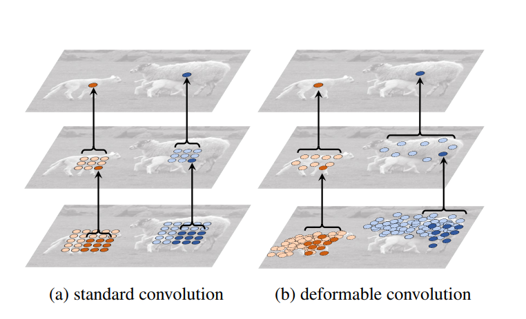

# DCNN: Deformable Convolutional Network for Image Classification on the COCO Dataset

This repository contains the code and experiments conducted for the Deep Learning Graduate Course project at the Electrical Engineering Department, Sharif University of Technology. The focus of this project is to explore the application of Deformable Convolutions for image classification on the COCO dataset.

## Project Overview

Convolutional Neural Networks (CNNs) have been the cornerstone of many state-of-the-art deep learning models, particularly in computer vision tasks. Traditional convolution operations use a fixed grid for the receptive field, limiting their ability to adapt to object shapes, scales, and orientations. Deformable Convolutions address this limitation by allowing the network to learn spatial sampling locations, thus enhancing its ability to handle complex visual patterns.

In this project, we implement Deformable Convolution layers within a CNN architecture and train it on the COCO dataset, which is a large-scale dataset for object detection, segmentation, and captioning. We compare the performance of models using standard convolutions with those using deformable convolutions to evaluate the effectiveness of this approach.

## Repository Structure

- `notebooks/`
  - `DL_CHW3_Q2_SajjadHashembeiki_98107077.ipynb`: The Jupyter notebook contains the full implementation of the project, including data preprocessing, model architecture, training, and evaluation. It also includes various experiments conducted to analyze the performance of deformable convolutions.
  
- `images/`
  - Visual representations and figures from the paper and results from the experiments are included for better understanding.

- `paper/`
  - The paper "Deformable Convolutional Networks" (provided as `1703.06211.pdf`) by Dai et al., which introduces the concept of Deformable Convolution Networks (DCNs).

. **Training the Model:**

   Follow the steps in the notebook to preprocess the data, build the model, and start the training process. The notebook includes all the necessary details and code blocks to run the experiments.

## Report and Compare The Models Performance

### Experiment Summary and Conclusion

In this section, we summarize the experiments conducted with deformable convolutions and standard convolutions, focusing on the performance and results.

1. **Experiment 1: Deformable Blocks in Last Two Convolution Layers**
   - **Training:** 5 epochs using SGD with a learning rate of 0.001.
   - **Results:**
     - Max Train Accuracy: 61.06%
     - Test Accuracy: 54.62%
   
2. **Experiment 2: Deformable Blocks in First Two Convolution Layers**
   - **Training:** 5 epochs using SGD with a learning rate of 0.001.
   - **Results:**
     - Max Train Accuracy: 46%
     - Test Accuracy: 44.63%
     - **Conclusion:** Poor performance, suggesting that using deformable blocks in the early layers is not effective.

3. **Experiment 3: Deformable Blocks in Middle Two Convolution Layers**
   - **Training:** 5 epochs using SGD with a learning rate of 0.001.
   - **Results:**
     - Max Train Accuracy: 55.25%
     - Test Accuracy: 53.65%
   - **Conclusion:** Placement of deformable blocks is crucial, and using them in middle layers yields better results than in early layers.

### Model Architectures

The final architectures used in the experiments are:

- **Standard CNN Model:**
  - Conv Layers: 6 convolution layers followed by max pooling and fully connected layers.
  - Final Training Results:
    - Train Accuracy: 57.65%
    - Validation Accuracy: 57.90%
    - Test Accuracy: 57.84%
    - Each epoch took around 50 seconds.

- **Deformable CNN (DCNN) Model:**
  - Conv Layers: 4 standard convolution layers and 2 deformable convolution layers.
  - Final Training Results:
    - Train Accuracy: 63.70%
    - Validation Accuracy: 66.10%
    - Test Accuracy: 65.89%
    - Each epoch took around 1 minute.
    - **Conclusion:** The DCNN model outperformed the standard CNN model, achieving an 8% improvement in test accuracy, though it required more training time.

### Key Takeaways

- Deformable Convolutions significantly improve model performance when placed in the right layers.
- Avoid placing deformable blocks in the early layers.
- Pooling layers between deformable blocks can reduce performance.
- Despite the increased training time due to additional computations, the performance gains justify the use of deformable convolutions.

### Additional Experiments

This architecture was also tested on the MNIST dataset:

- **CNN Model Accuracy:** 90.03%
- **DCNN Model Accuracy:** 92.90%

## Conclusion

Deformable Convolutions provide a significant advantage in tasks requiring the model to adapt to irregular object shapes and structures. This project demonstrates their effectiveness on the COCO dataset, showcasing the potential for improving image classification tasks in real-world scenarios.

## References

- Xizhou Zhu, Han Hu, Stephen Lin, Jifeng Dai. "Deformable Convolutional Networks." [arXiv:1703.06211](https://arxiv.org/abs/1703.06211).
- COCO Dataset: [COCO](http://cocodataset.org/)

---

This README provides an overview of the project, its implementation, results, and detailed comparisons of the models. For more insights, please refer to the provided Jupyter notebook and the associated paper.
